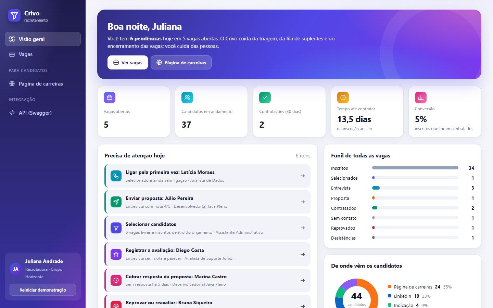
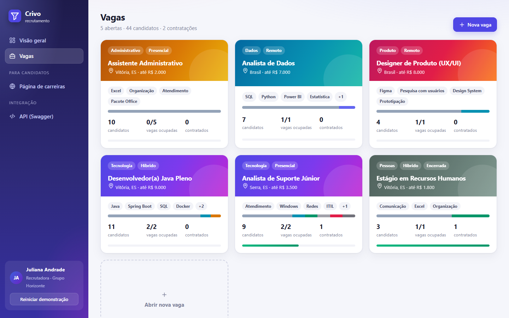
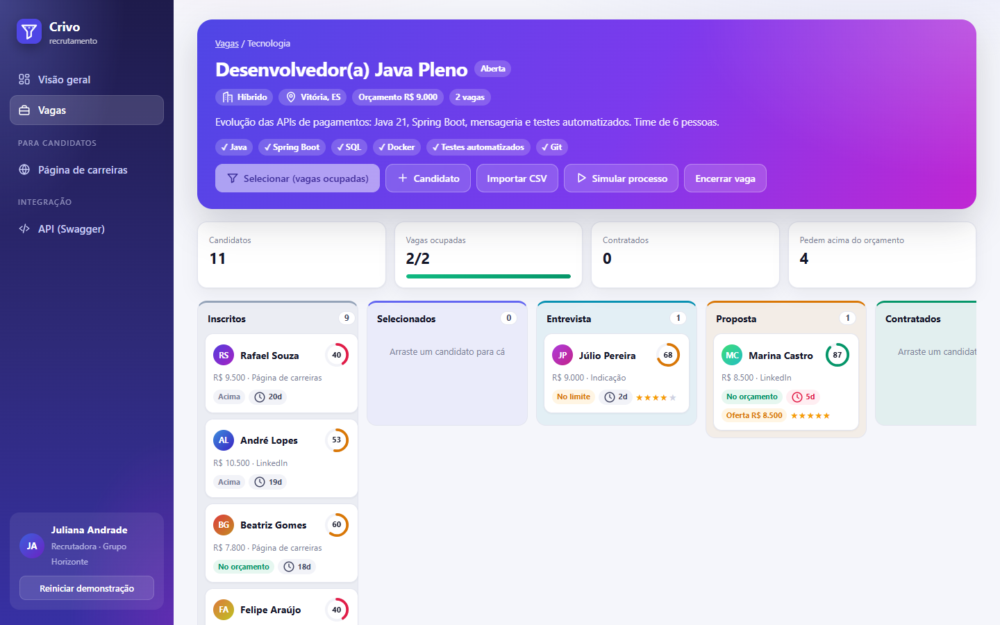
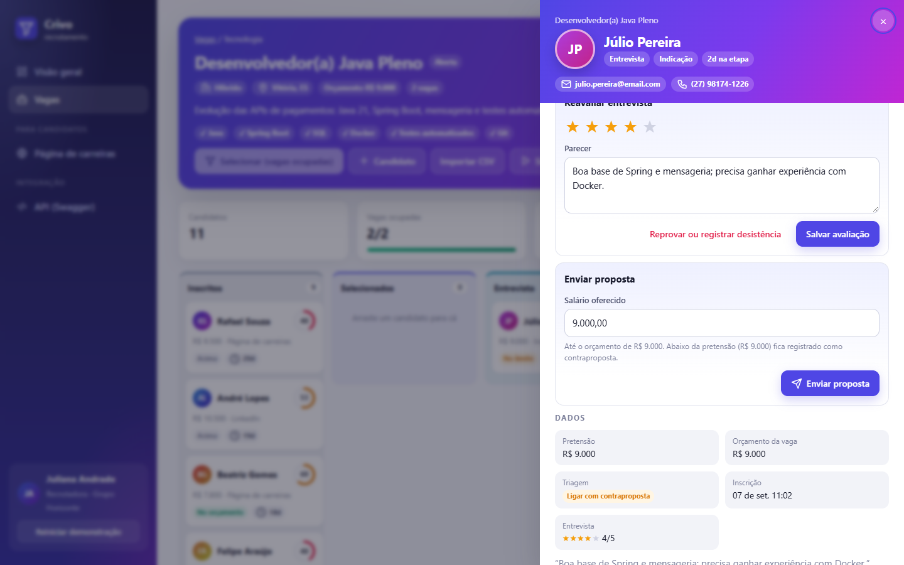
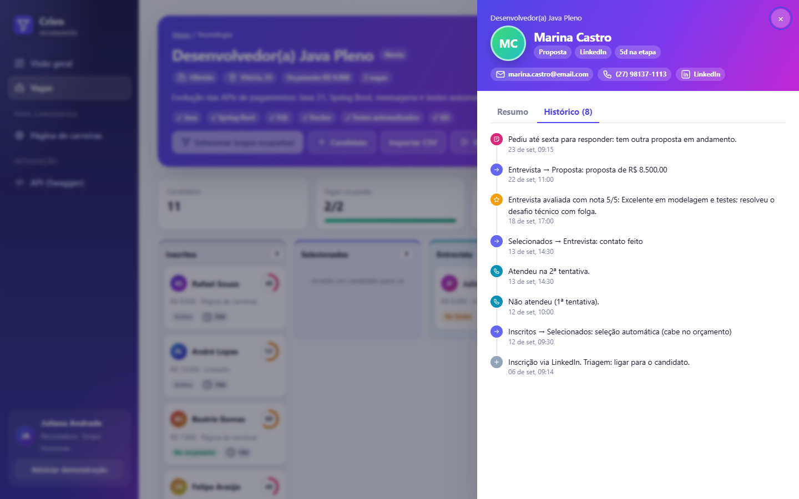
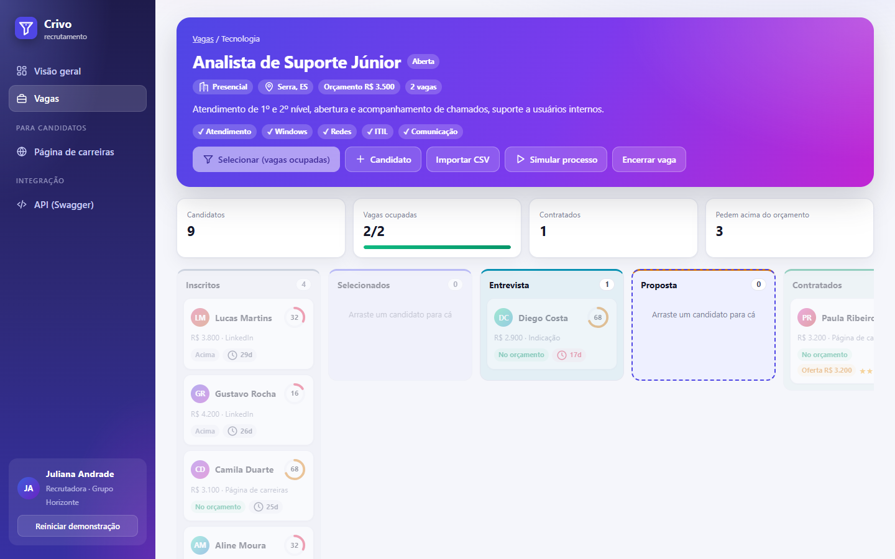
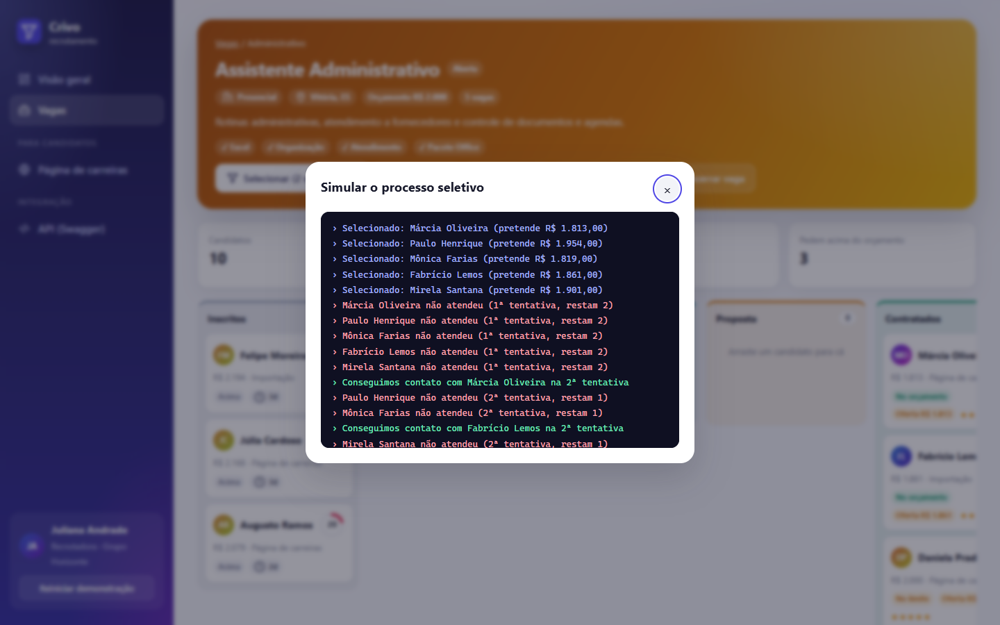
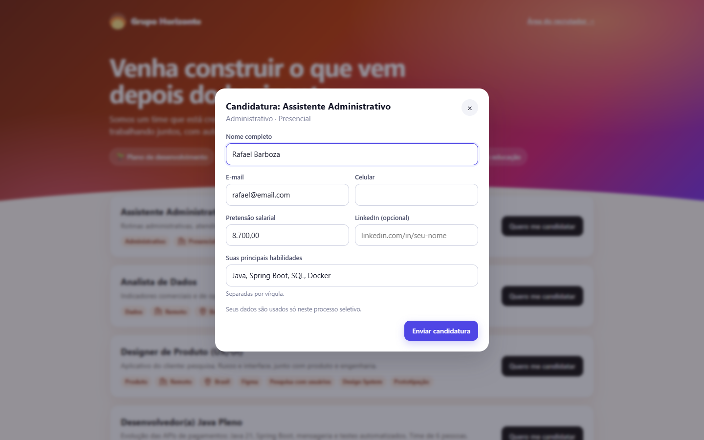
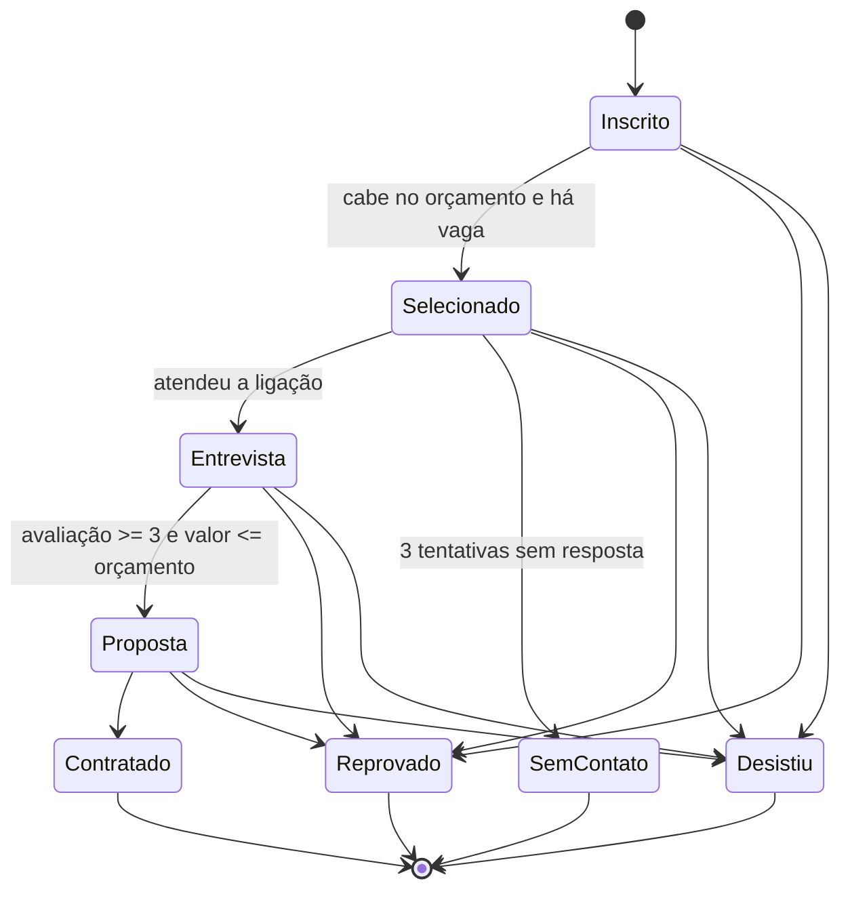

<p align="center">
  
</p>

<h1 align="center">Crivo</h1>

<p align="center">
  <b>Recrutamento sem candidato esquecido.</b><br>
  Um ATS (sistema de recrutamento) completo: triagem pelo orçamento, compatibilidade com a vaga, fila de suplentes,<br>
  avaliação da entrevista, proposta com contraproposta, página pública de carreiras e um Kanban validado por máquina de estados.
</p>

<p align="center">
  <a href="https://github.com/barbozadevti/crivo/actions/workflows/ci.yml"></a>
  
  
  
  
</p>



## Experimente

```bash
docker compose up --build
```

Abra **http://localhost:5240**. Sem Docker: `mvn spring-boot:run` (JDK 21 + Maven). No Windows, o atalho `Abrir Crivo.cmd` compila na primeira vez e abre o navegador.

O Crivo já abre com o **Grupo Horizonte** (empresa fictícia) e 6 vagas em momentos diferentes do processo. Para ver tudo em 2 minutos:

1. **Visão geral:** a lista *Precisa de atenção hoje* leva direto a cada pendência (ligar, avaliar, enviar proposta, cobrar resposta).
2. **Vaga Desenvolvedor(a) Java Pleno:** abra o Júlio (entrevista avaliada) e envie a proposta; arraste cartões para ver as colunas permitidas.
3. **Vaga Assistente Administrativo:** o caso das aulas (salário base de R$ 2.000,00, 5 vagas). Clique em **▶ Simular processo**.
4. **Página de carreiras** (menu lateral): candidate-se a uma vaga e veja o candidato chegar ao quadro com a compatibilidade calculada.

**Reiniciar demonstração** (no rodapé do menu) recarrega tudo.

## Funcionalidades

### Para o recrutador
- **Visão geral**: vagas abertas, candidatos em andamento, contratações nos últimos 30 dias, **tempo médio até contratar**, taxa de conversão, funil de todas as vagas, origem dos candidatos e atividade recente.
- **Precisa de atenção hoje**: selecionados sem ligação, novas tentativas, entrevistas sem avaliação, propostas prontas para envio, propostas sem resposta há dias e vagas com lugar livre.
- **Triagem pelo orçamento** na inscrição: pretende menos, ligar; igual, contraproposta; mais, aguardar (a regra das aulas).
- **Compatibilidade de 0 a 100**: 80 pontos pelos requisitos da vaga que o candidato tem (sem diferença de acento ou maiúscula) e 20 pelo encaixe no orçamento. O cartão mostra um anel colorido; a ficha mostra o que atende e o que falta.
- **Seleção automática** em ordem de inscrição, respeitando o orçamento e o número de vagas.
- **Contato**: até 3 ligações; na terceira sem resposta, o candidato sai e o **suplente** que cabe no orçamento é chamado.
- **Avaliação da entrevista** (nota de 1 a 5 e parecer) e **proposta com valor**: exige nota mínima 3, não passa do orçamento e, abaixo da pretensão, fica registrada como **contraproposta**.
- **Kanban** com arrastar e soltar: ao arrastar, só as colunas permitidas se destacam; soltar em *Proposta* abre a ficha no formulário da proposta.
- **Tempo na etapa** em cada cartão (fica vermelho a partir de 5 dias), estrelas da avaliação e valor ofertado.
- **Ficha do candidato** em gaveta lateral: contatos, LinkedIn, compatibilidade, dados, ações da etapa, **notas** e histórico completo.
- **Importação por CSV** colado de planilha (com habilidades) e **simulação** do processo com sorteio repetível.
- **Encerramento automático** da vaga ao completar as contratações.

### Para o candidato
- **Página "Trabalhe conosco"** com as vagas abertas, benefícios e formulário de candidatura. O candidato nunca vê a triagem nem o orçamento exato; recebe só a confirmação.

<table>
  <tr>
    <td></td>
    <td></td>
  </tr>
  <tr>
    <td></td>
    <td></td>
  </tr>
  <tr>
    <td></td>
    <td></td>
  </tr>
  <tr>
    <td></td>
    <td></td>
  </tr>
</table>

<p align="center"></p>

## De onde veio

O Crivo nasceu do desafio de **controle de fluxo** da DIO ([entrega original](https://github.com/barbozadevti/java-processo-seletivo)): um processo seletivo em que o `if` decide se o candidato cabe no salário, o `while` seleciona até 5, o `for` lista os selecionados e o `do/while` tenta a ligação até 3 vezes. Aqui essas regras viraram produto, com os recursos modernos do Java:

| No desafio | No Crivo |
|---|---|
| `if / else if / else` pelo salário pretendido | `enum Recomendacao`, calculada na inscrição e reaproveitada na compatibilidade e na contraproposta |
| `while` até 5 selecionados | Seleção em ordem de inscrição, respeitando orçamento e número de vagas |
| `do / while` até 3 tentativas | Cada ligação registrada; na 3ª sem resposta, suplente automático |
| Mensagens soltas no console | **Máquina de estados** com `switch` exaustivo e resultados com `sealed interface` + `record` + *pattern matching* |
| `ParametrosInvalidosException` | Exceções de negócio que viram `409` (transição proibida) e `422` (regra violada) em `problem+json` |

## A máquina de estados



```java
public Set<Etapa> proximas() {
    return switch (this) {
        case INSCRITO -> EnumSet.of(SELECIONADO, REPROVADO, DESISTIU);
        case SELECIONADO -> EnumSet.of(ENTREVISTA, SEM_CONTATO, REPROVADO, DESISTIU);
        case ENTREVISTA -> EnumSet.of(PROPOSTA, REPROVADO, DESISTIU);
        case PROPOSTA -> EnumSet.of(CONTRATADO, REPROVADO, DESISTIU);
        case CONTRATADO, SEM_CONTATO, REPROVADO, DESISTIU -> EnumSet.noneOf(Etapa.class);
    };
}
```

O `switch` é exaustivo: uma etapa nova sem regra de transição nem compila. "Sem contato" só é definido pelo Crivo, depois de 3 ligações; "Proposta" só com avaliação e valor.

## Decisões de engenharia

| Tema | Decisão |
|---|---|
| Regras no domínio | `Candidato` só muda de etapa pela máquina de estados e devolve o `Evento` do histórico; o serviço não "força" etapas. |
| Histórico realista | Todo caso de uso tem uma versão que recebe a data (`moverEm`, `avaliarEm`...), usada pelos dados de demonstração para espalhar o histórico nas últimas semanas. |
| Evolução do banco | Duas migrações Flyway: `V1` (estrutura) e `V2` (requisitos, habilidades, origem, avaliação, proposta), como numa base em produção. SQL portável entre H2 e PostgreSQL. |
| Transações | Operações que podem falhar por regra não são chamadas dentro de outra transação que precise continuar (a simulação usa uma seleção "sem falhar"), evitando o *rollback-only* do Spring. |
| Privacidade | A API pública de carreiras não expõe orçamento, triagem nem outros candidatos. |
| Cache do site | Os arquivos estáticos pedem revalidação (`Cache-Control: no-cache`), para ninguém ver uma tela antiga depois de uma atualização. |
| Frontend | Módulos JavaScript sem framework; cores de avatar e larguras de barras aplicadas via CSSOM (nada de estilo inline no HTML). Tema claro e escuro. |

## Testes

```bash
mvn verify
```

**110 testes**, rodando também contra o **PostgreSQL** no CI (e um job sobe o **Docker Compose**):

| Área | O que é verificado |
|---|---|
| Máquina de estados | As **64 combinações** de etapa de origem e destino, contra uma tabela escrita à parte |
| Triagem e compatibilidade | Limites da regra das aulas (R$ 1.999,99 / 2.000,00 / 2.000,01) e 5 cenários de pontuação calculados à mão |
| Seleção e contato | Ordem de inscrição, quem pede acima é pulado, 3 tentativas, suplente que cabe no orçamento |
| Avaliação e proposta | Sem avaliação não há proposta; nota mínima; teto do orçamento; contraproposta no histórico |
| Visão geral | Cada tipo de pendência aparece quando deve (e some quando resolvida) |
| Simulação | Mesma semente, mesmo resultado; em 25 sementes, nenhuma regra é quebrada |
| API | `404`, `409`, `422`, `400` em `problem+json`, página de carreiras sem dados internos, importação CSV |

## Arquitetura

```
src/main/java/dev/barboza/crivo/
├── dominio/   Vaga, Candidato, Evento, Etapa (máquina de estados), Recomendacao, Compatibilidade, ResultadoDoContato (sealed)
├── servico/   RecrutamentoService, PainelService (visão geral), SimulacaoService
├── api/       RecrutamentoController (recrutador), CarreirasController (público), erros em problem+json
└── config/    Demonstração (Grupo Horizonte), relógio, OpenAPI e abertura do navegador
src/main/resources/
├── db/migration/   V1 e V2 (Flyway)
└── static/js/      app, painel, vagas, quadro, candidato, carreiras, ui
```

A API está documentada em **/swagger-ui.html**.

## Produto

Escopo, personas e ordem das entregas estão na [Lean Inception](docs/lean-inception.md). Próximas ondas: login de recrutadores e gestores; agenda de entrevistas e e-mails automáticos.
