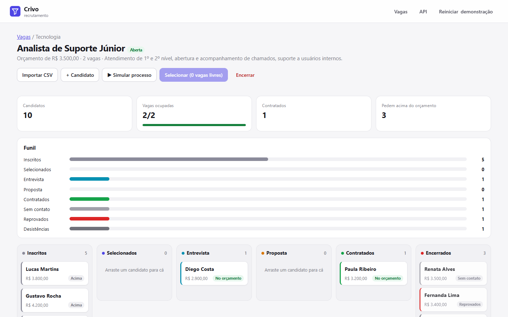
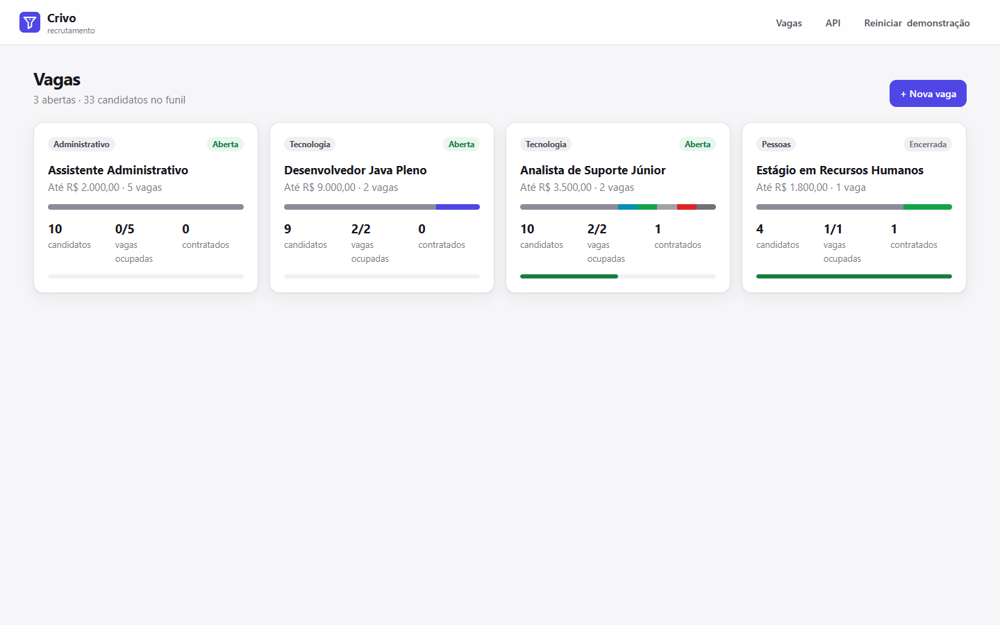
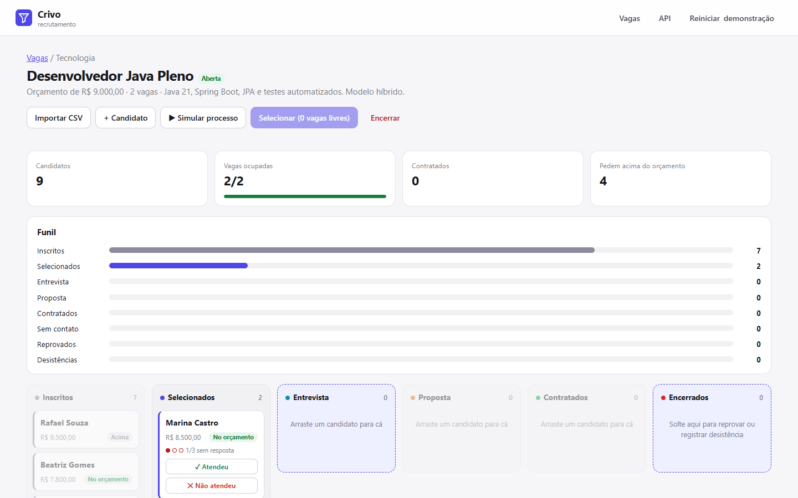
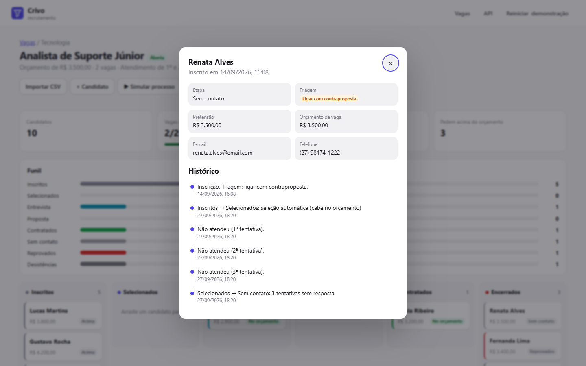
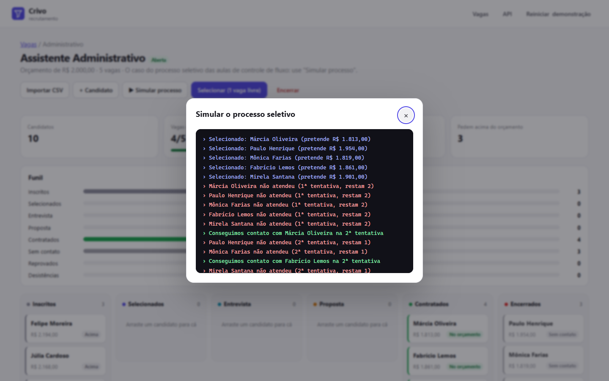
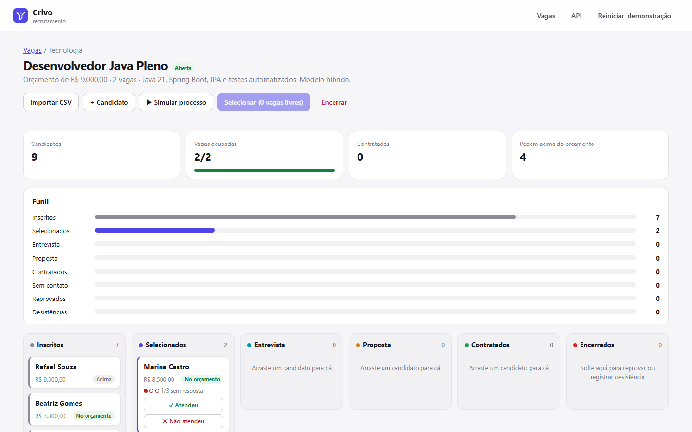
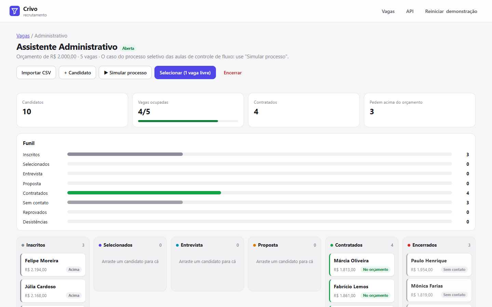
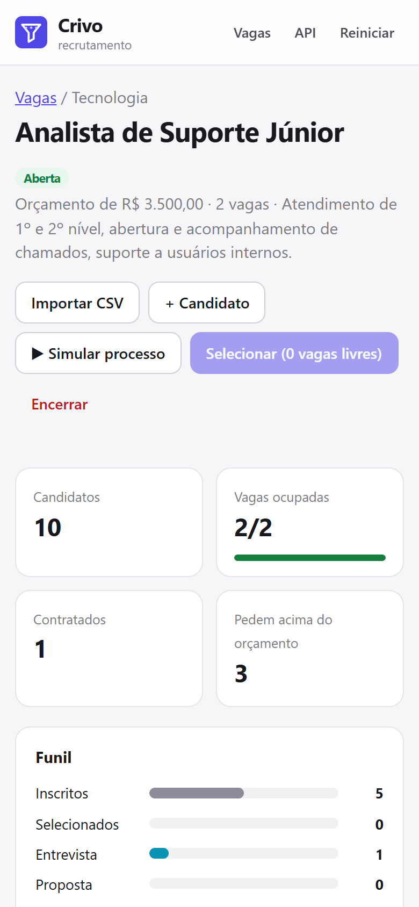
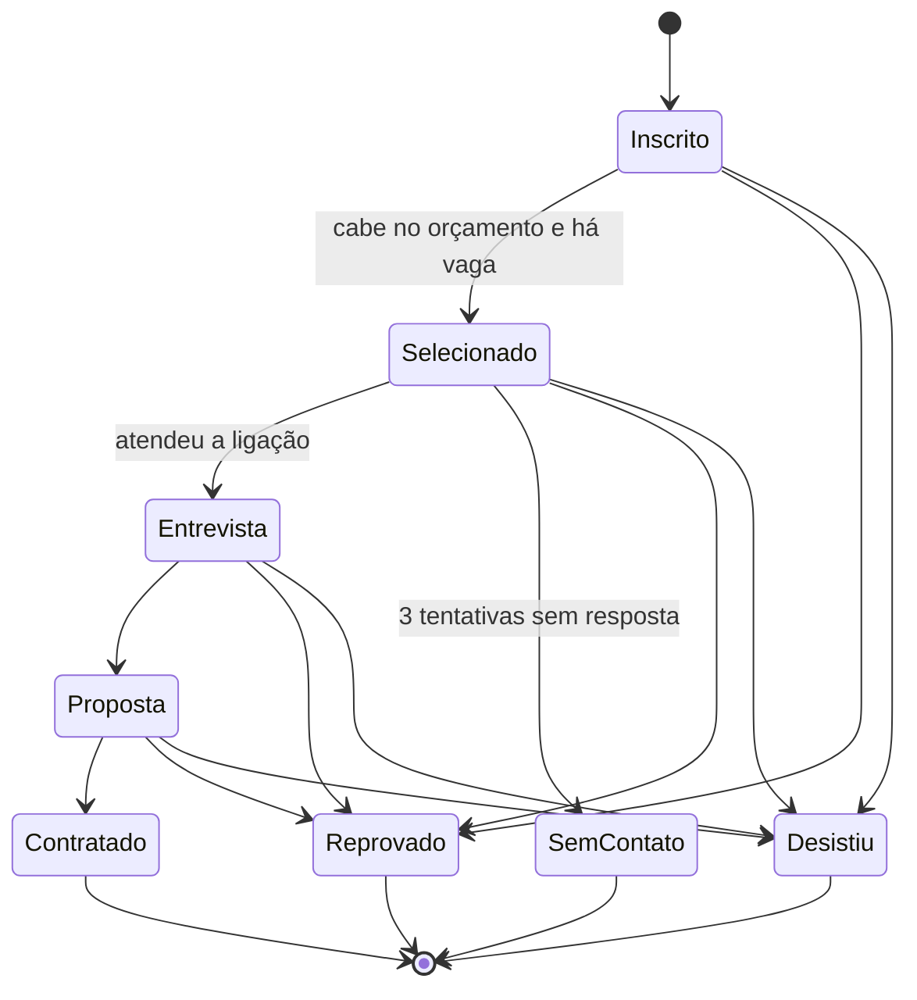

<p align="center">
  
</p>

<h1 align="center">Crivo</h1>

<p align="center">
  <b>Recrutamento sem candidato esquecido.</b><br>
  Triagem automática pelo orçamento da vaga, seleção até completar as vagas, até 3 tentativas de contato<br>
  com chamada do suplente e um quadro Kanban validado por uma máquina de estados.
</p>

<p align="center">
  <a href="https://github.com/barbozadevti/crivo/actions/workflows/ci.yml"></a>
  
  
  
  
</p>



## De onde veio

O Crivo nasceu do desafio de **controle de fluxo** da DIO ([entrega original](https://github.com/barbozadevti/java-processo-seletivo)): um processo seletivo em que o `if` decide se o candidato cabe no salário, o `while` seleciona até 5, o `for` lista os selecionados e o `do/while` tenta a ligação até 3 vezes.

Aqui essas mesmas regras viraram um produto: um pequeno ATS (sistema de recrutamento) que um recrutador usaria de verdade, e que mostra os recursos modernos do Java para **controle de fluxo**:

| No desafio | No Crivo |
|---|---|
| `if / else if / else` pelo salário pretendido | `enum Recomendacao` (ligar, contraproposta, aguardar), calculada na inscrição |
| `while` até 5 selecionados | Seleção automática em ordem de inscrição, respeitando o orçamento e o número de vagas da vaga |
| `do / while` até 3 tentativas | Registro de cada ligação; na 3ª sem resposta o candidato sai e o **suplente é chamado** |
| Mensagens soltas no console | **Máquina de estados** (`switch` exaustivo sobre as etapas) e resultados com `sealed interface` + `record` + *pattern matching* |
| `ParametrosInvalidosException` | Exceções de negócio que viram `409` (transição proibida) e `422` (regra violada) em `problem+json` |

## Experimente

```bash
docker compose up --build
```

Abra **http://localhost:5240**. Sem Docker: `mvn spring-boot:run` (JDK 21 + Maven; o banco H2 fica em `~/.crivo`). No Windows, o atalho `Abrir Crivo.cmd` compila na primeira vez e abre o navegador.

Já vêm 4 vagas de exemplo, cada uma num momento diferente do processo:

| Vaga | O que ver |
|---|---|
| Analista de Suporte Júnior | Uma contratada, um em entrevista, uma "sem contato" depois de 3 ligações (e o suplente chamado) |
| Desenvolvedor Java Pleno | Dois selecionados esperando ligação: use **✓ Atendeu / ✕ Não atendeu** no cartão |
| Assistente Administrativo | O caso das aulas (salário base de R$ 2.000,00, 5 vagas): clique em **▶ Simular processo** |
| Estágio em Recursos Humanos | Vaga que fechou sozinha ao completar a contratação |

O botão **Reiniciar demonstração** recarrega tudo.

## Funcionalidades

- **Vagas** com orçamento (salário base) e quantidade de vagas.
- **Triagem na inscrição**: pretende menos que o orçamento, ligar; igual, ligar com contraproposta; mais, aguardar os demais.
- **Seleção automática**: percorre a fila em ordem de inscrição e seleciona quem cabe no orçamento, até completar as vagas.
- **Contato**: até 3 tentativas por candidato. Na terceira sem resposta, o candidato vai para "sem contato" e o próximo da fila que cabe no orçamento é chamado.
- **Kanban**: arrastar e soltar entre etapas. Ao começar a arrastar, o quadro destaca só as colunas permitidas; o servidor valida de novo.
- **Suplente automático**: quem ocupava uma vaga e sai (reprovado, desistência, sem contato) libera o lugar para o próximo.
- **Encerramento automático**: ao completar as contratações, a vaga fecha sozinha.
- **Histórico** de cada candidato (inscrição, cada ligação, cada mudança de etapa, com o motivo).
- **Funil** por vaga e quantos candidatos pedem acima do orçamento (sinal para rever a faixa salarial).
- **Importação por CSV** colado de uma planilha. Linhas com erro não impedem as demais e voltam explicadas.
- **Simulação** do processo inteiro com sorteio repetível (mesma semente, mesmo resultado): 1 chance em 3 de atender o telefone, como nas aulas.

<table>
  <tr>
    <td></td>
    <td></td>
  </tr>
  <tr>
    <td></td>
    <td></td>
  </tr>
  <tr>
    <td></td>
    <td></td>
  </tr>
</table>

<p align="center"></p>

## A máquina de estados



```java
public Set<Etapa> proximas() {
    return switch (this) {
        case INSCRITO -> EnumSet.of(SELECIONADO, REPROVADO, DESISTIU);
        case SELECIONADO -> EnumSet.of(ENTREVISTA, SEM_CONTATO, REPROVADO, DESISTIU);
        case ENTREVISTA -> EnumSet.of(PROPOSTA, REPROVADO, DESISTIU);
        case PROPOSTA -> EnumSet.of(CONTRATADO, REPROVADO, DESISTIU);
        case CONTRATADO, SEM_CONTATO, REPROVADO, DESISTIU -> EnumSet.noneOf(Etapa.class);
    };
}
```

O `switch` é exaustivo: uma etapa nova sem regra de transição nem compila. "Sem contato" só pode ser definido pelo próprio Crivo, depois de 3 ligações registradas, e nunca pelo arrastar e soltar.

## Testes

```bash
mvn verify
```

**94 testes**, rodando também contra o **PostgreSQL** no CI:

| Área | O que é verificado |
|---|---|
| Máquina de estados | As **64 combinações** de etapa de origem e destino, contra uma tabela escrita à parte |
| Triagem | A regra das aulas, incluindo os limites (R$ 1.999,99, R$ 2.000,00, R$ 2.000,01) |
| Seleção | Ordem de inscrição, quem pede acima do orçamento é pulado, limite de vagas |
| Contato | 3 tentativas, suplente que cabe no orçamento, "sem contato" nunca manual |
| Vaga | Encerramento automático ao completar as contratações; nada muda depois disso |
| Simulação | Mesma semente, mesmo resultado; e, em 25 sementes diferentes, nenhuma regra é quebrada |
| API | Status HTTP (`404`, `409`, `422`, `400`) em `problem+json`, importação CSV e contato com suplente |

## Arquitetura

```
src/main/java/dev/barboza/crivo/
├── dominio/   Vaga, Candidato, Evento, Etapa (máquina de estados), Recomendacao, ResultadoDoContato (sealed)
├── servico/   RecrutamentoService (seleção, contato, suplente, encerramento) e SimulacaoService
├── api/       RecrutamentoController e erros em problem+json
└── config/    Demonstração, relógio, OpenAPI e abertura do navegador
src/main/resources/
├── db/migration/   Migrações Flyway (H2 e PostgreSQL)
└── static/         Site em HTML, CSS e JavaScript, sem framework (tema claro e escuro)
```

A API está documentada em **/swagger-ui.html**.

## Produto

Escopo, personas e ordem das entregas estão na [Lean Inception](docs/lean-inception.md). Próximas ondas: login de recrutadores e gestores, agenda de entrevistas e e-mails automáticos.
